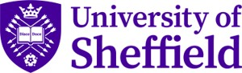
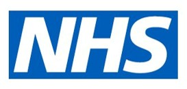
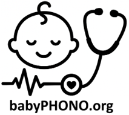
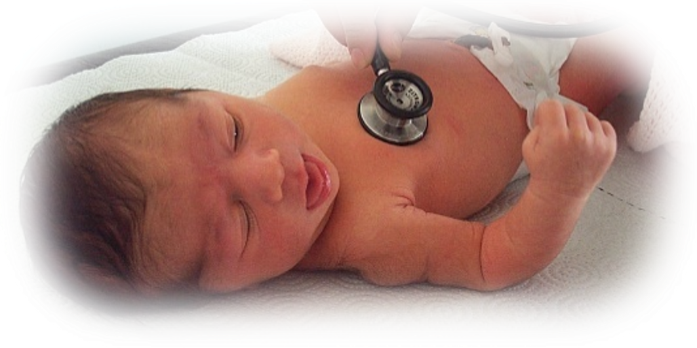
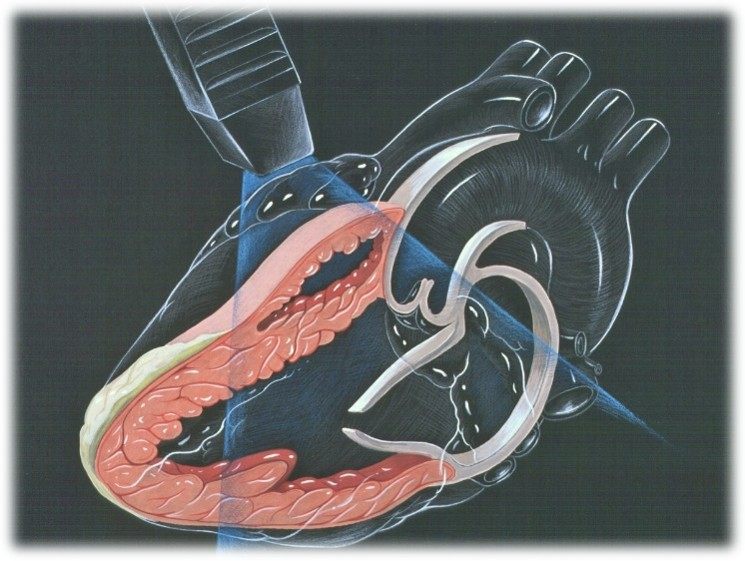
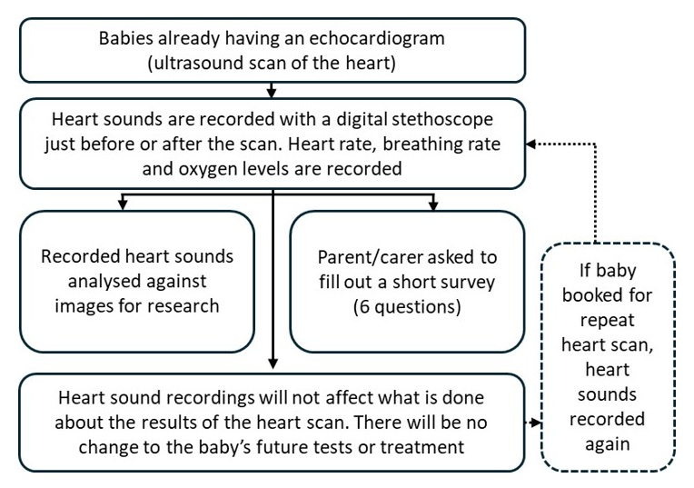
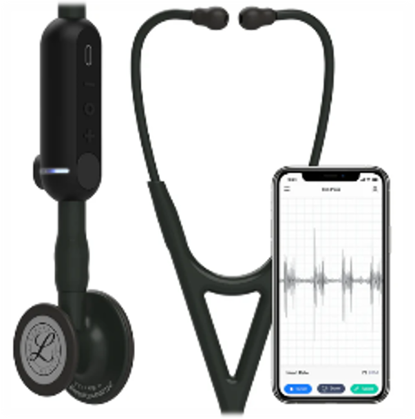
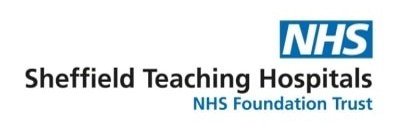
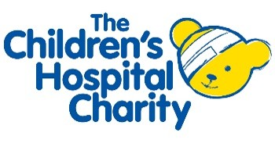

```{=html}
<style>
#title-block-header, main.content { direction: rtl; text-align: right; }
main.content { line-height: 1.9; }
main.content .ltr { direction: ltr; unicode-bidi: isolate; display: inline-block; }
main.content .centered { text-align: center; }
</style>
```

::: {.centered dir="rtl"}
**التسجيلات الرقمية لأصوات القلب لدى الرضّع أثناء الفحص البدني لحديثي الولادة والرضّع: دراسة babyPHONO**

{width="50%" fig-align="center"} {width="50%" fig-align="center"}

{height="200px"}
:::

::: {dir="rtl"}
نودّ دعوتك أنت وطفلك للمشاركة في دراستنا البحثية. قبل اتخاذ القرار، نودّ أن تفهم سبب إجراء هذا البحث وما تتضمنه المشاركة فيه. سيشرح لك أحد أعضاء فريقنا هذه المعلومات ويجيب عن أي أسئلة لديك. يُرجى سؤالنا إذا كان هناك أي شيء غير واضح، أو إذا كنت ترغب في الحصول على مزيد من المعلومات. خذ الوقت الذي تحتاجه لتقرر ما إذا كنت ترغب في مشاركة طفلك أم لا. المشاركة اختيارية تمامًا.

## لماذا نجري هذا البحث؟

يعاني أقل من طفل واحد من كل 100 طفل من مشكلة في بنية القلب. إذا اكتشفنا هذه المشكلة مبكرًا، فقد نتمكن من علاجها بصورة أكثر فعالية. نريد معرفة ما إذا كان بإمكاننا تسجيل أصوات قلوب الرضّع للمساعدة في اكتشاف مشكلات القلب.

نأمل في إشراك ما لا يقل عن 200 طفل من جناح جيسوب في هذا البحث. وإذا نجحت هذه الدراسة، فنأمل أن تؤدي إلى دراسات أخرى تساعدنا في المستقبل على اكتشاف مشكلات القلب لدى الرضّع بصورة أكثر فعالية.
:::

::: {.centered dir="rtl"}
{width="50%" fig-align="center"}
:::

::: {dir="rtl"}
## هل يجب عليك المشاركة في هذا البحث؟

لا، فقرار المشاركة يعود إليك، ولن يؤثر عدم المشاركة على الرعاية التي تتلقاها أنت أو طفلك. يمكنك الانسحاب من الدراسة في أي وقت، ولا يلزمك تقديم سبب للانسحاب.

## ماذا سيحدث لك ولطفلك إذا شاركتما في هذا البحث؟

تهدف هذه الدراسة البحثية إلى تسجيل أصوات قلوب الرضّع باستخدام سماعة طبية رقمية، لمعرفة ما إذا كان بإمكاننا استخدام الذكاء الاصطناعي للمساعدة في اكتشاف مشكلات القلب عن طريق تحليل التسجيلات. وستُقارن هذه التسجيلات بنتائج فحص القلب باستخدام تقنية «تعلّم الآلة».

إذا قررت المشاركة، فسيُطلب منك توقيع نموذج الموافقة. سيُسجّل أحد أعضاء فريق البحث أصوات قلب طفلك باستخدام سماعة طبية رقمية. كما سيُسجّل معدل تنفّس طفلك ومعدل ضربات قلبه ومستوى الأكسجين لديه. بعد الانتهاء، سيُطلب منك إكمال استبيان قصير جدًا يتكوّن من 6 أسئلة. وبعد سنة، سيتصل بك أحد الباحثين هاتفيًا ليطرح عليك بعض الأسئلة القصيرة التي تستغرق أقل من 15 دقيقة، للتحقق مما إذا كان طفلك قد شُخّص في أي وقت بمشكلة في القلب.

إذا حُجز لطفلك موعد لإعادة فحص القلب، فسنسجّل أيضًا أصوات قلبه وقت الفحص المتكرر، ما لم تنسحب من الدراسة.

لن يغيّر تسجيل أصوات القلب في هذه الدراسة البحثية ما يُجرى لطفلك. فسيظل يتلقى فحص القلب نفسه بالموجات فوق الصوتية، وأي فحوص أخرى أو علاج ضروري، كما لو لم يكن مشاركًا في الدراسة البحثية.
:::

::: {.centered dir="rtl"}
{width="50%" fig-align="center"}
:::

::: {dir="rtl"}
## ملخّص ما يحدث للمشاركين في هذه الدراسة
:::

::: {.centered dir="rtl"}
<!-- The referenced flowchart image may contain English text. Translate the image separately before publishing an entirely Arabic page. -->

{width="80%" fig-align="center"}
:::

::: {dir="rtl"}
## ما مخاطر هذا البحث؟

تشبه السماعة الطبية الرقمية السماعة الطبية العادية إلى حد كبير، ولا تشكّل أي خطر على طفلك. تحتوي السماعة على جهاز رقمي متصل بأنبوبها يلتقط الصوت، ثم ينقله لاسلكيًا إلى هاتف محمول أو جهاز لوحي. بعد ذلك، يُحفظ التسجيل عبر الإنترنت في «السحابة»، باستخدام خادم حاسوبي في الولايات المتحدة الأمريكية. وقد اعتمدت وكالة تنظيم الأدوية ومنتجات الرعاية الصحية هذا الجهاز للاستخدام في المملكة المتحدة.

قد تعني المشاركة في هذا البحث أن فحص الطفل يستغرق نحو 2 إلى 5 دقائق إضافية. كما سيستغرق إكمال الاستبيان بعد الفحص والردّ على المكالمة الهاتفية بعد سنة قدرًا بسيطًا من وقتك. هناك احتمال أن يُدخل الأطباء أو غيرهم من الممارسين السريريين معلومات شخصية في تطبيق السماعة الطبية الرقمية عن طريق الخطأ. ستُراجع المعلومات الموجودة في هذا التطبيق أسبوعيًا، وسيحذف فريق البحث أي بيانات يمكن أن تكشف عن الهوية للحدّ من هذا الخطر.
:::

::: {.centered dir="rtl"}
{width="50%" fig-align="center"}
:::

::: {dir="rtl"}
## ما فائدة المشاركة في هذا البحث؟

لن تعود المشاركة في البحث بفائدة مباشرة عليك أو على طفلك. لكننا نأمل أن يساعد هذا البحث الأطفال الذين سيولدون في المستقبل، من خلال مساعدة الأطباء على اكتشاف مشكلات القلب في وقت أبكر من الحياة.

## كيف سنستخدم المعلومات المتعلقة بك وبطفلك؟

سنحتاج إلى استخدام معلومات عنك وعن طفلك في هذا المشروع البحثي.

ستشمل هذه المعلومات اسمك وبيانات الاتصال بك. وستشمل أيضًا رقم هيئة الخدمات الصحية الوطنية (NHS) ورقم المستشفى الخاصين بك وبطفلك. سيستخدم الأشخاص هذه المعلومات لإجراء البحث أو للتحقق من سجلاتكما للتأكد من تنفيذ البحث بصورة صحيحة.

لن يتمكن الأشخاص الذين لا يحتاجون إلى معرفة هويتك من الاطلاع على اسمك أو بيانات الاتصال بك. وسيُستخدم رقم رمزي بدلًا منها في بياناتك. ستُحفظ التسجيلات الرقمية لأصوات القلب والصور الناتجة عن أي فحوص لتخطيط صدى القلب دون أسماء؛ لذلك لن يعرف الشخص الذي تعود إليه هذه التسجيلات والصور إلا الأشخاص الذين يعرفون ما يشير إليه الرقم الرمزي المستخدم في البحث.

جامعة شيفيلد هي الجهة الراعية لهذا البحث، وهي المسؤولة عن حماية معلوماتك. سنشارك معلوماتك المتعلقة بهذا المشروع البحثي مع الأنواع التالية من المؤسسات:

- مؤسسات تقديم الرعاية الصحية التابعة لهيئة الخدمات الصحية الوطنية (NHS) المشاركة في هذه الدراسة البحثية.

سنحافظ على سلامة جميع معلوماتك وأمنها من خلال:

- حفظ اسمك وبيانات الاتصال بك وأرقام المستشفى في جدول بيانات محمي بكلمة مرور على الأنظمة الحاسوبية الآمنة في مستشفى جناح جيسوب، وبشكل منفصل عن البيانات التي تُجمع ضمن الدراسة.
- السماح لأعضاء فريق الدراسة البحثية فقط بالوصول إلى جدول البيانات المحمي بكلمة مرور.

## نقل البيانات إلى خارج المملكة المتحدة

قد نشارك بيانات عن طفلك خارج المملكة المتحدة أو نتيح الوصول إليها لأغراض تتعلق بالبحث. وستُزال المعلومات التي تكشف عن الهوية من تسجيلات أصوات القلب والمعلومات المتعلقة بعمر طفلك، إلى جانب أي تشخيص مستقبلي لمشكلات القلب.

قد نشارك بيانات عنك خارج المملكة المتحدة أو نتيح الوصول إليها لأغراض تتعلق بالبحث، من أجل:

- استخدامها في أبحاث مستقبلية.
- المساعدة في تطوير برمجيات للأجهزة الطبية.

إذا شاركنا بيانات من هذا البحث، فلن نشارك إلا البيانات اللازمة. وسنحرص أيضًا، قدر الإمكان، على ألا يكون من الممكن التعرف على طفلك من البيانات التي تُشارك. وقد لا يكون ذلك ممكنًا في بعض الظروف؛ فعلى سبيل المثال، إذا كان طفلك يعاني من مرض نادر، فقد يظل من الممكن التعرف عليه. وإذا شُوركت بيانات طفلك خارج المملكة المتحدة، فسيكون ذلك مع الأنواع التالية من المؤسسات:

- مؤسسات بحثية.
- مؤسسات للتكنولوجيا الطبية.
- مؤسسات لتطوير البرمجيات.

سنحرص على حماية بيانات طفلك. ويجب على أي شخص يصل إلى بيانات طفلك خارج المملكة المتحدة الالتزام بتعليماتنا، حتى تتمتع هذه البيانات بمستوى حماية مماثل لما تتمتع به بموجب قانون المملكة المتحدة. وسنحافظ على أمن بيانات طفلك خارج المملكة المتحدة من خلال ما يلي:

بعض البلدان التي ستُشارك معها بيانات طفلك لديها قرار كفاية لحماية البيانات. وهذا يعني أننا نعرف أن قوانينها توفّر مستوى حماية مماثلًا لقوانين حماية البيانات في المملكة المتحدة.

نستخدم عقودًا محددة معتمدة للاستخدام في المملكة المتحدة، تمنح البيانات الشخصية مستوى الحماية نفسه الذي تتمتع به في المملكة المتحدة. لمزيد من التفاصيل، يُرجى زيارة موقع مكتب مفوّض المعلومات (ICO):

[معلومات حول نقل البيانات إلى الخارج](https://ico.org.uk/for-organisations/uk-gdpr-guidance-and-resources/international-transfers/)

لا نسمح لمن يصلون إلى بيانات طفلك خارج المملكة المتحدة باستخدامها لأي غرض غير ما ينصّ عليه عقدنا المكتوب معهم. ونشترط على المؤسسات الأخرى اتخاذ تدابير أمنية مناسبة لحماية بيانات طفلك، بما يتوافق مع التزاماتنا المتعلقة بأمن البيانات وسريتها. ويشمل ذلك تدابير مناسبة لحماية بياناتك من الفقد العرضي ومن الوصول أو الاستخدام أو التغيير أو المشاركة دون تصريح.

لدينا إجراءات للتعامل مع أي اشتباه في خرق للبيانات الشخصية. وسنُبلغك ونُبلغ الجهات التنظيمية المعنية عند حدوث خرق للبيانات الشخصية لطفلك إذا كان القانون يلزمنا بذلك. لمزيد من التفاصيل حول قواعد الإبلاغ عن خروقات البيانات في المملكة المتحدة، يُرجى زيارة موقع مكتب مفوّض المعلومات (ICO):

[معلومات حول الإبلاغ عن خرق للبيانات](https://ico.org.uk/for-organisations/report-a-breach)

لن تُشارك المعلومات التي يمكن أن تكشف عن الهوية، بما فيها الأسماء وتواريخ الميلاد، مع أي شخص خارج فريق البحث في شيفيلد أو الممارسين السريريين المسؤولين عن رعايتك أو رعاية طفلك. ويمكنك المشاركة في الدراسة حتى إذا رفضت مشاركة البيانات مع أطراف ثالثة؛ وسيُذكر هذا القرار بصورة منفصلة في نموذج الموافقة.

## كيف سنستخدم المعلومات المتعلقة بك بعد انتهاء الدراسة؟

بعد انتهاء الدراسة، سنحتفظ ببعض البيانات حتى نتمكن من التحقق من النتائج. وسنكتب تقاريرنا بطريقة لا تسمح لأي شخص بمعرفة أن طفلك شارك في الدراسة. سنحتفظ ببيانات الدراسة الخاصة بك لمدة أقصاها 5 سنوات. وبعد ذلك، ستُزال منها تمامًا المعلومات التي تكشف عن الهوية، وستُحفظ في أرشيف آمن أو تُتلف.

## ما الخيارات المتاحة لك بشأن استخدام معلوماتك؟

يمكنك إنهاء مشاركتك ومشاركة طفلك في الدراسة في أي وقت، دون تقديم سبب، لكننا سنحتفظ بالمعلومات التي حصلنا عليها بالفعل. يحق لك أن تطلب منا الاطلاع على البيانات التي نحتفظ بها عنك لأغراض الدراسة، أو إزالتها أو تعديلها أو حذفها. كما يمكنك الاعتراض على معالجتنا لبياناتك. وقد لا نتمكن دائمًا من تلبية هذه الطلبات إذا كان ذلك سيمنعنا من استخدام بياناتك لإجراء البحث. وفي هذه الحالة، سنشرح لك سبب عدم قدرتنا على ذلك. وإذا وافقت على المشاركة في هذه الدراسة، فسيكون لديك خيار المشاركة في أبحاث مستقبلية باستخدام بياناتك المحفوظة من هذه الدراسة.

## أين يمكنك معرفة المزيد عن كيفية استخدام معلوماتك؟

يمكنك معرفة المزيد عن كيفية استخدامنا لمعلوماتك، بما في ذلك الآلية المحددة التي نستخدمها عند نقل بياناتك الشخصية إلى خارج المملكة المتحدة، من خلال:

- نشرتنا: [معلومات المرضى والبحث](https://www.hra.nhs.uk/patientdataandresearch).
- سؤال أحد أعضاء فريق البحث.
- إرسال بريد إلكتروني إلى: [[sth.babyphono\@nhs.net](mailto:sth.babyphono@nhs.net)]{.ltr}.
- الاتصال بنا على: [+447729849599]{.ltr}.

## ماذا لو كانت لديّ أسئلة أخرى عن البحث؟

إذا كانت لديك أي أسئلة عن الدراسة، يمكنك التواصل معنا باستخدام عنوان البريد الإلكتروني أو رقم الهاتف الموجود على ظهر هذه النشرة. ويمكنك أيضًا طرح الأسئلة على الباحث الذي يطلب منك توقيع نموذج الموافقة.

## ماذا لو كان لديّ سؤال أو شكوى بشأن الرعاية السريرية التي تلقيتها؟

يجب ألا تستخدم أي استبيان يُطلب منك إكماله خلال هذه الدراسة للإبلاغ عن مخاوف تتعلق برعايتك أو رعاية طفلك. إذا كان لديك سؤال أو شكوى بشأن الرعاية السريرية، فيُرجى التحدث إلى الممارسين السريريين المسؤولين عن رعايتك، أو طلب معلومات عن خدمة تقديم المشورة للمرضى والتواصل معهم (PALS).

## ماذا لو كانت لديّ شكوى بشأن البحث؟

إذا كنت غير راضٍ وترغب في تقديم شكوى، فيُرجى التواصل أولًا مع الدكتورة أليس غريفيثس:

[[alys.griffiths\@sheffield.ac.uk](mailto:alys.griffiths@sheffield.ac.uk)]{.ltr}

إذا شعرت بأن شكواك لم تُعالج بطريقة مُرضية، يمكنك التواصل مع البروفيسورة هيذر مورتيبويز:

[[h.mortiboys\@sheffield.ac.uk](mailto:h.mortiboys@sheffield.ac.uk)]{.ltr}، أو الاتصال على [0114 222 2290]{.ltr}.

إذا كانت الشكوى تتعلق بكيفية التعامل مع بياناتك الشخصية، يمكنك العثور على معلومات حول تقديم شكوى في إشعار الخصوصية الخاص بالجامعة:

[إشعار الخصوصية بجامعة شيفيلد](https://www.sheffield.ac.uk/govern/data-protection/privacy/general)

إذا كنت ترغب في الإبلاغ عن مخاوف أو حادث يتعلق باحتمال حدوث استغلال أو إساءة أو ضرر نتيجة مشاركتك في هذا المشروع، فيُرجى التواصل مع جهة الاتصال المعيّنة للحماية من الأذى، الدكتور هاريس ستافرولاكيس:

[[t.stavroulakis\@sheffield.ac.uk](mailto:t.stavroulakis@sheffield.ac.uk)]{.ltr}

إذا استمر قلقك، فيُرجى التواصل مع مديرة أخلاقيات البحث ونزاهته، ليندسي أنوين:

[[l.v.unwin\@sheffield.ac.uk](mailto:l.v.unwin@sheffield.ac.uk)]{.ltr}

## هل وافقت لجنة أخلاقيات على هذا البحث؟

راجعت لجنة أخلاقيات البحث في جنوب شرق اسكتلندا 1 هذا البحث. الرقم المرجعي للبحث هو: [358145]{.ltr}.

**شكرًا لك على التفكير في المشاركة في هذا البحث.**

لمزيد من المعلومات عن هذه الدراسة البحثية، يُرجى التواصل معنا:

**البريد الإلكتروني:** [[sth.babyphono\@nhs.net](mailto:sth.babyphono@nhs.net)]{.ltr}

**رقم هاتف الدراسة:** [+447729849599]{.ltr}

**تُجرى هذه الدراسة البحثية في:** مستشفى جناح جيسوب، تري روت ووك، برومهول، شيفيلد، [S10 2SF]{.ltr}.
:::

::: {.centered dir="rtl"}
{width="50%" fig-align="center"}
:::

::: {dir="rtl"}
**الجهة الراعية لهذه الدراسة البحثية:** جامعة شيفيلد، ويسترن بانك، شيفيلد، [S10 2TN]{.ltr}.

**مسؤول حماية البيانات:** لوك تومبسون.

**البريد الإلكتروني:** [[dataprotection\@sheffield.ac.uk](mailto:dataprotection@sheffield.ac.uk)]{.ltr}

**الهاتف:** [+44 114 222 1117]{.ltr}
:::

::: {.centered dir="rtl"}
{width="50%" fig-align="center"}
:::

::: {dir="rtl"}
**الجهة المموّلة لهذه الدراسة البحثية:** المؤسسة الخيرية لمستشفى شيفيلد للأطفال، 4 مارلبورو رود، شيفيلد، [S10 1DB]{.ltr}.
:::

::: {.centered dir="rtl"}
{width="50%" fig-align="center"}
:::
