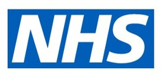
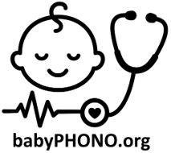
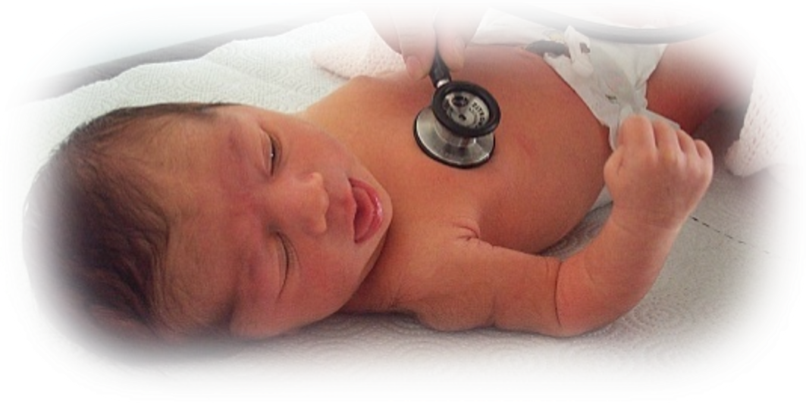
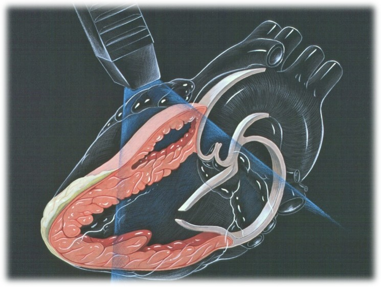
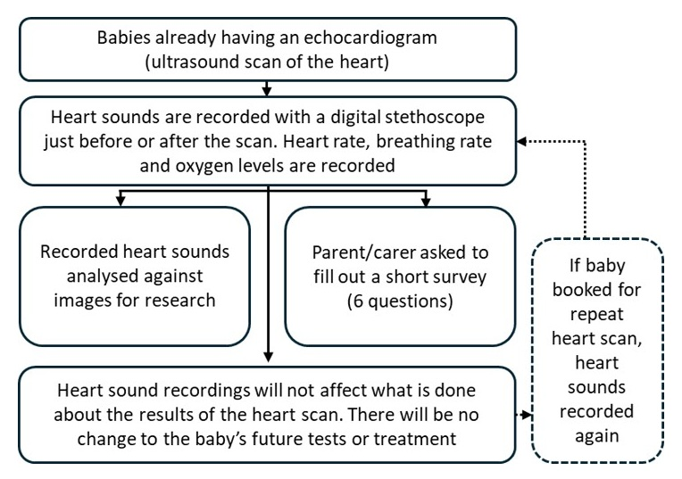
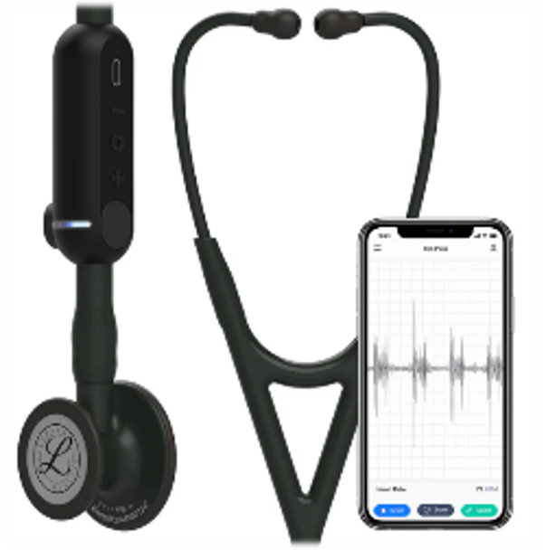
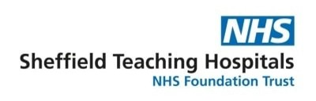
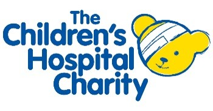

::: {style="text-align: center;"}
<b>Digital recordings of heart sounds in babies during the Newborn Infant Physical Examination: the babyPHONO study</b>

{width="50%" fig-align="center"}
{width="50%" fig-align="center"}

{height="200px"}

 
::: 

::: {style="text-align: left;"}
We would like to invite you and your baby to take part in our research study.  Before you decide, we would like you to understand why the research is being done and what it will involve.
One of our team will go through this information with you and answer any questions you may have.
Ask us if there is anything that is not clear or if you would like more information.  Take time to decide whether or not you want your child to take part. Participation is completely voluntary.

<b>Why are we doing this research?</b>

Less than 1 in 100 babies have a problem with the structure of the heart. If we find this early, we may be able to treat it more effectively. We want to see if we can record the heart sounds of babies, to help find problems with the heart.
We are hoping to recruit at least 200 babies from Jessop Wing to take part in this research. If this study is successful, we hope that it will lead to further studies that in the future help us detect heart problems in babies more effectively.
:::
::: {style="text-align: center;"}
{width="50%" fig-align="center"}
:::
::: {style="text-align: left;"}
<b>What will happen to you and your baby if you take part in this research?</b>

This research study is looking to record the heart sounds of babies using a digital stethoscope. This is to find out whether we can use artificial intelligence to help detect heart problems by analysing the recordings. These recordings will be compared to the findings of the heart scan using ‘machine learning’.

If you decide to take part, you will be asked to sign the consent form. A member of the research team will record the heart sounds of your baby using a digital stethoscope. They will also record your babies breathing rate, heart rate and oxygen levels. You will then be asked to complete a very short 6 question survey after it has finished. One year later, a researcher will phone you and ask you some short questions, that will take less than 15 minutes. These will be to check if your baby has ever been diagnosed with a problem with their heart. 

If your baby is booked for a repeat scan of the heart, we will also record the heart sounds at the time of that repeat scan, unless you withdraw from the study. 

In this research study, the recording of the heart sounds will not change what happens to your baby. They will still receive the same ultrasound scan of the heart, and any other necessary scans or treatment that they would if they were not in the research study. 

:::
::: {style="text-align: center;"}
{width="50%" fig-align="center"}
:::
::: {style="text-align: left;"}

<b>Summary of what happens to participants in this study:</b>

:::
::: {style="text-align: center;"}
{width="80%" fig-align="center"}
:::
::: {style="text-align: left;"}
 
<b>What are the risks of this research?</b>
The digital stethoscope is very similar to a normal stethoscope, and does not pose any risk to your baby. The stethoscope has a digital device attached to its tubing that captures sound. This gets transmitted wirelessly to a mobile phone or tablet. The recording then gets stored online in ‘the cloud’, using a computer server in the United states of America. This device has been approved by the medicines and healthcare products regulatory agency for use in the United Kingdom. 

Taking part in this research may mean the baby check takes around 2 to 5 minutes longer. Filling in the questionnaire afterwards and taking the phone call in a year will take a small amount of your time. 
There is a risk that clinicians accidentally enter personal information into the digital stethoscope application. The information within this application will be reviewed weekly, and any personally identifiable data will be deleted by the research team to guard against this risk. 

:::
::: {style="text-align: center;"}
{width="50%" fig-align="center"}
:::
::: {style="text-align: left;"}

<b>What is the benefit in taking part in this research?</b>

Taking part in the research will not directly benefit you or your baby. However, we hope that this research will help babies born in the future by helping doctors identify problems with the heart earlier in life.

<b>How will we use information about you and your baby?</b>

We will need to use information from you and your baby for this research project.

This information will include your name and contact details. It will also include you and your baby’s NHS number and hospital number. People will use this information to do the research or to check your records to make sure that the research is being done properly.

People who do not need to know who you are will not be able to see your name or contact details. Your data will have a code number instead. Digital recordings of heart sounds and images from any echocardiograms will be stored without names, so only people who know what the research code number means will know which person they came from.

The University of Sheffield is the sponsor for this research. The University of Sheffield is responsible for looking after your information. We will share your information related to this research project with the following types of organisations:

•	The NHS health provider organisations involved in this research study.
We will keep all information about you safe and secure by:

•	Keeping your name, contact details and hospital numbers in a password protected spreadsheet on the Jessop Wing Hospital secure computer systems, separate from the data collected within the study.

•	Only allowing members of the research study team access to the password protected spreadsheet.

<b>International transfers</b>

We may share or provide access to data about your baby outside the UK for research related purposes to:
The recorded heart sounds and information about how old your baby is, along with any future diagnosis of heart problems will be anonymised. 

We may share or provide access to data about you outside the UK for research related purposes to:

•	Be used for future research

•	Help develop software for medical devices

If we do share data from this research, we will only share the data that is needed. We will also make sure your baby can’t be identified from the data that is shared where possible. This may not be possible under certain circumstances – for instance, if your baby has a rare illness, it may still be possible to identify them. If your baby’s data is shared outside the UK, it will be with the following sorts of organisations:

•	Research organisations

•	Medical technology organisations

•	Software development organisations

We will make sure your baby’s data is protected. Anyone who accesses your baby’s data outside the UK must do what we tell them so that your baby’s data has a similar level of protection as it does under UK law. We will make sure your baby’s data is safe outside the UK by doing the following:

Some of the countries your baby’s data will be shared with have an adequacy decision in place. This means that we know their laws offer a similar level of protection to data protection laws in the UK.

We use specific contracts approved for use in the UK which give personal data the same level of protection it has in the UK. For further details visit the Information Commissioner’s Office (ICO) website: https://ico.org.uk/for-organisations/uk-gdpr-guidance-and-resources/international-transfers/
We do not allow those who access your baby’s data outside the UK to use it for anything other than what our written contract with them says.
We need other organisations to have appropriate security measures to protect your baby’s data which are consistent with the data security and confidentiality obligations we have. This includes having appropriate measures to protect your data against accidental loss and unauthorised access, use, changes or sharing.
We have procedures in place to deal with any suspected personal data breach. We will tell you and applicable regulators when there has been a breach of your baby’s personal data when this is legally required. For further details about UK breach reporting rules visit the Information Commissioner's Office (ICO) website: https://ico.org.uk/for-organisations/report-a-breach
Personally identifiable information (including names and dates of birth) will never be shared with anyone outside of the research team in Sheffield or clinicians taking care of you or your baby. You can still take part in the study if you would decline data sharing with third parties, this will be declared separately on your consent form.

<b>How will we use information about you after the study ends?</b>
Once we have finished the study, we will keep some of the data so we can check the results. We will write our reports in a way that no-one can work out that your baby took part in the study.
We will keep your study data for a maximum of 5 years. The study data will then be fully anonymised and securely archived or destroyed.

<b>What are your choices about how your information is used?</b>
You can stop yourself and your baby being part of the study at any time, without giving a reason, but we will keep information about you that we already have.
You have the right to ask us to access, remove, change or delete data we hold about you for the purposes of the study. You can also object to our processing of your data. We might not always be able to do this if it means we cannot use your data to do the research. If so, we will tell you why we cannot do this.
If you agree to take part in this study, you will have the option to take part in future research using your data saved from this study.

Where can you find out more about how your information is used?
You can find out more about how we use your information, including the specific mechanism used by us when transferring your personal data out of the UK:
•	our leaflet www.hra.nhs.uk/patientdataandresearch
•	by asking one of the research team
•	by sending an email to sth.babyphono@nhs.net, or
•	by ringing us on +447729849599

<b>What if I have a question or complaint about the clinical care I have received?</b>

Any questionnaire you are asked to complete during this study should not be used to report clinical concerns about you or your baby’s care. If you have a question or complaint about your clinical care, please speak to the clinicians looking after you or ask for details about the patient advice and liaison service. 

What if I have a complaint about the research?
If you are unhappy and wish to make a complaint, please contact Dr Alys Griffiths (alys.griffiths@sheffield.ac.uk) in the first instance. If you feel your complaint has not been handled in a satisfactory way you can contact Professor Heather Mortiboys (h.mortiboys@sheffield.ac.uk) or 0114 222 2290. If the complaint relates to how your personal data has been handled, you can find information about how to raise a complaint in the University’s Privacy Notice: https://www.sheffield.ac.uk/govern/data-protection/privacy/general.
If you wish to make a report of a concern or incident relating to potential exploitation, abuse or harm resulting from your involvement in this project, please contact the Designated Safeguarding Contact Dr Haris Stavroulakis (t.stavroulakis@sheffield.ac.uk). If you remain concerned, please contact the Research Ethics & Integrity Manager Lindsay Unwin (l.v.unwin@sheffield.ac.uk).
Has this research been approved by an ethics committee?
The research has been reviewed by the South East Scotland Research Ethics Committee 1. The reference number for the research is: 358145.

Thank you for considering taking part in this research.						

For further information about this research study, please contact:
E-mail: 			
[sth.babyphono\@nhs.net](mailto:sth.babyphono@nhs.net){.email}
sth.babyphono@nhs.net  	
Study phone number: 	
+447729849599

This research study is taking place at:
Jessop Wing Hospital
Tree Root Walk, 
Broomhall, 
Sheffield, 
S10 2SF
 
:::
::: {style="text-align: center;"}
{width="50%" fig-align="center"}
:::
::: {style="text-align: left;"}
 
 
This research study is sponsored by:
The University of Sheffield
Western Bank, 
Sheffield, 
S10 2TN
Data protection officer: 				
Luke Thompson
dataprotection@sheffield.ac.uk 			
+44 114 222 1117
 

:::
::: {style="text-align: center;"}
{width="50%" fig-align="center"}
 

:::
::: {style="text-align: left;"}
This research study is funded by:
Sheffield Children’s Hospital Charity
4 Marlborough Rd, Sheffield, S10 1DB
 

:::
::: {style="text-align: center;"}
{width="50%" fig-align="center"}
 

:::
