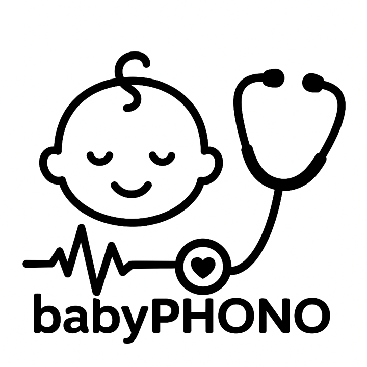

::: {style="text-align: center;"}
Welcome to the babyPHONO research study website

This study is recruiting patients under 3 months already having an echocardiogram as part of the normal clinical care. They are eligible for the study if a clinician has heard a heart murmur, or if the baby has previously had an echocardiogram that showed a structural heart defect.

This study is an observational feasibility study, that does not change the clinical care of the babies. 

For the participant information leaflet for babies undergoing an echocardiogram, please [click here](echo-information.qmd).

{width="200px"}

 

For more information please contact [sth.babyphono\@nhs.net](mailto:sth.babyphono@nhs.net){.email}
:::
