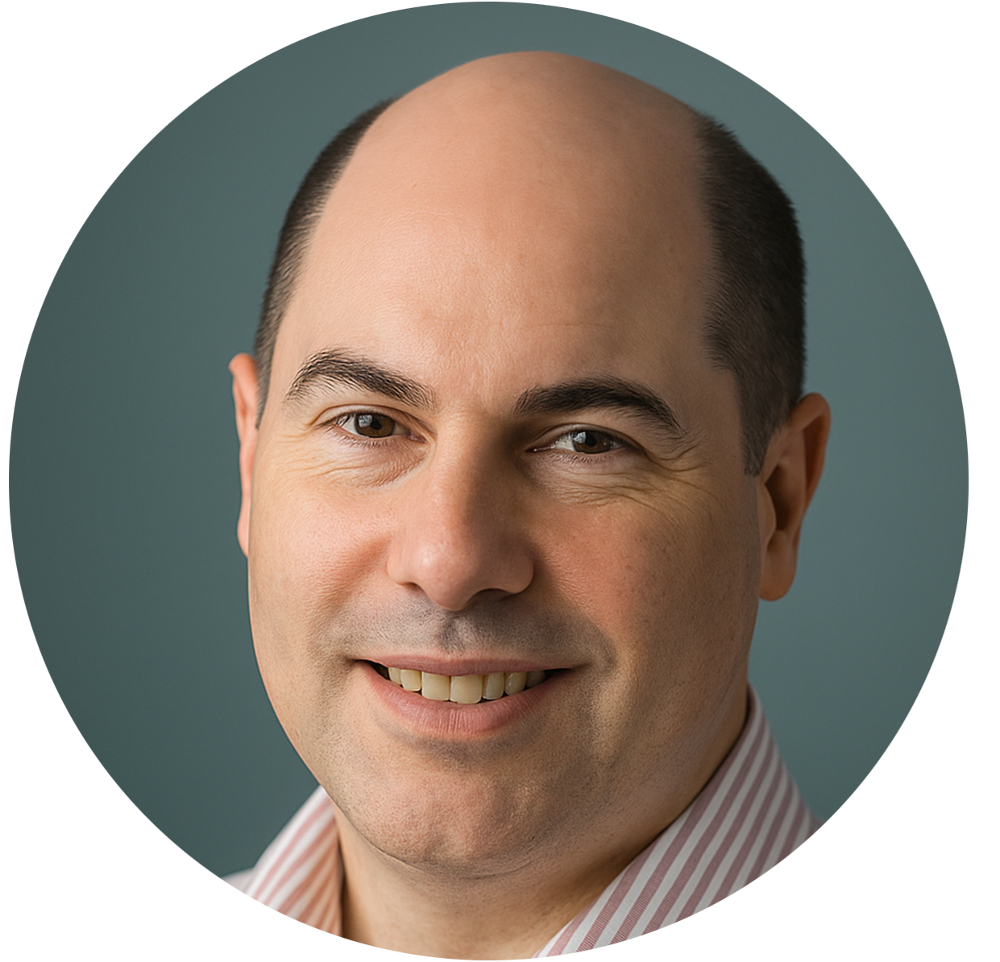
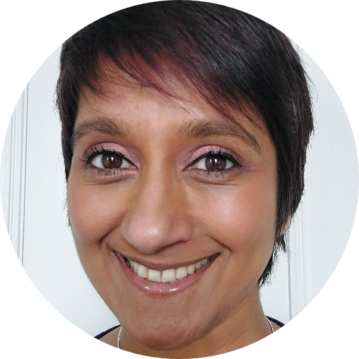
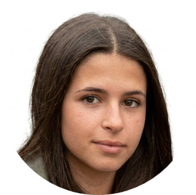
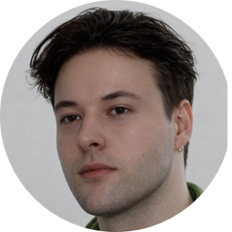

::: {style="text-align: center;"}

Welcome to the **babyPHONO** study team!\
Our group includes clinicians, researchers, and data scientists collaborating to improve the early diagnosis of congenital heart disease.
:::

------------------------------------------------------------------------

:::::::: team-grid
::: team-member
<p class="team-name">Dr Neil<br>Lawrence</p>


<p><em>Chief Investigator</em></p>

<p>Paediatrics<br>Registrar</p>
:::

::: team-member
<p class="team-name">Dr Simon<br>Clark</p>



<p><em>Principal Investigator</em></p>

<p>Consultant<br>Neonatologist</p>
:::

::: team-member
<p class="team-name">Dr Tamanna<br>Williams</p>



<p><em>Head of Recruitment</em></p>

<p>Consultant<br>Neonatologist</p>
:::

::: team-member
<p class="team-name">Professor Tim<br>Chico</p>


<p><em>Co-Investigator</em></p>

<p>Professor of<br>Cardiology</p>
:::

::: team-member
<p class="team-name">Professor Jeremy<br>Dawson</p>


<p><em>Lead statistician</em></p>

<p>Professor of<br>Statistics</p>
:::

::: team-member
<p class="team-name">Dr Louis<br>Stokes</p>


<p><em>Co-investigator</em></p>

<p>Qualitative Researcher</p>
:::

::: team-member
<p class="team-name">Ms Yasmin<br>Kumar</p>



<p><em>Intercalated Research student</em></p>

<p>Student Doctor</p>
:::

::: team-member
<p class="team-name">Mr Alexander<br>Darby</p>



<p><em>Software Designer</em></p>

<p>Student Doctor</p>
:::
::::::::

------------------------------------------------------------------------

```{=html}
<style>
.team-grid {
  display: grid;
  grid-template-columns: repeat(auto-fit, minmax(220px, 1fr));
  gap: 1.5rem;
  margin-top: 1.5rem;
}

.team-name {
  font-size: 1.25rem;
  font-weight: 700;
  text-align: center;
  margin: 0 0 1rem 0;
  line-height: 1.2;
}

.team-member {
  text-align: center;
  padding: 1rem;
  background: #fafafa;
  border-radius: 1rem;
  box-shadow: 0 2px 6px rgba(0,0,0,0.1);
}

.team-photo {
  width: 150px;
  height: 150px;
  object-fit: cover;
  border-radius: 50%;
  margin-bottom: 0.75rem;
}
</style>
```
